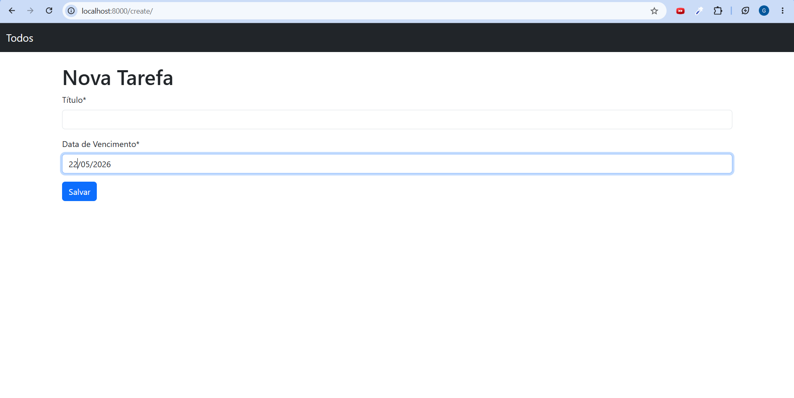
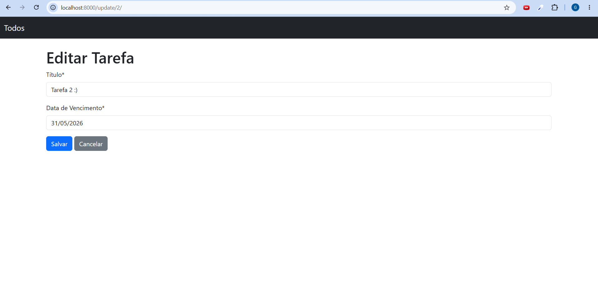

# ✅ Django ToDo App

Aplicação web de gerenciamento de tarefas desenvolvida com Django.

O projeto consiste em uma aplicação simples de lista de tarefas utilizando as principais operações de CRUD, permitindo ao usuário criar, editar, concluir e excluir tarefas.

A aplicação foi desenvolvida seguindo o padrão de arquitetura MVT do Django, utilizando SQLite para persistência de dados. Para visualização e análise da tabela do banco de dados, foi utilizado o Beekeeper Studio.

---

# 🛠️ Tecnologias Utilizadas

- Python
- Django
- SQLite
- Bootstrap
- HTML5
- CSS3

---

# ⚙️ Instalação e execução

## Instalar dependências

```bash
pip install -r requirements.txt
```

## Executar migrations

```bash
python manage.py migrate
```

## Rodar o servidor

```bash
python manage.py runserver
```

---

# 🎯 Objetivo do Projeto

Este projeto foi desenvolvido com foco em aprendizado prático de:

- Desenvolvimento web com Django
- CRUD completo
- Models e migrations
- Class Based Views
- Templates
- Organização de aplicações Django

---

# 📚 Aprendizados

Durante o desenvolvimento deste projeto foram praticados conceitos como:

- Estrutura MVT do Django
- Manipulação de banco de dados
- Rotas e Views
- Templates dinâmicos
- Integração entre frontend e backend
- Boas práticas de organização

---

# 📸 Preview





---

# 👨‍💻 Autor

Desenvolvido por Guilherme Fantato.
